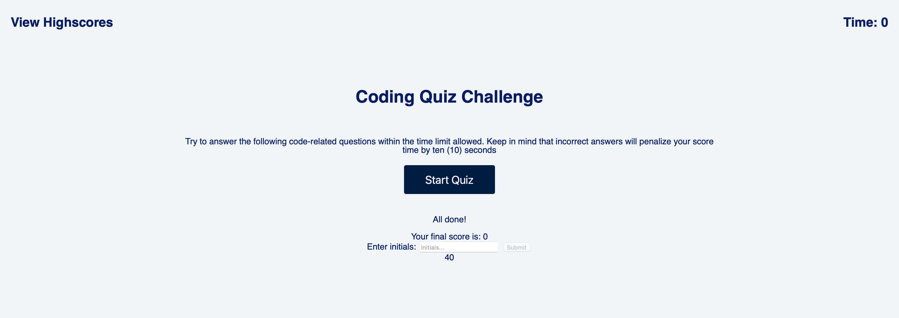
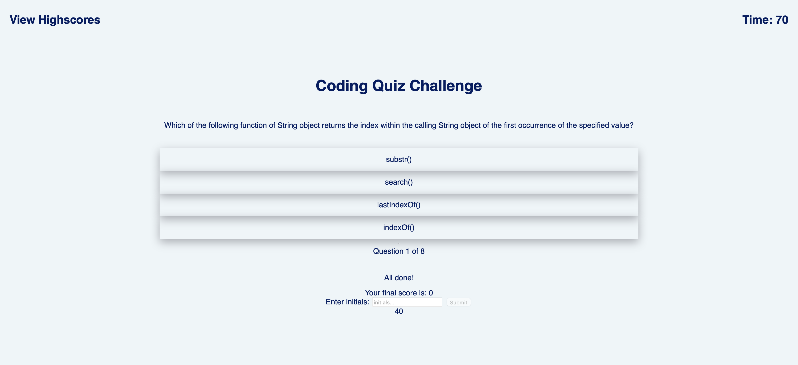

# code-quiz-app
A timed coding quiz with multiple choice questions

## Description
This is a coding quiz application that enables the user take a quiz and see their scores as well as thier last recorded score entries.This is powerd by javascript and web APIs. 
The Javascript code provides a clean, polished and responsive user interface that adopts to multiple screen sizes.

## User Guide
This section provides detailed description on how to use the code quiz app:

When the "Start" button is clicked, the user sees a series of questions listed and the toimer is started. When the question  is answered, they move to the next question and if the question is  answered correctly, the green highlight is seen else if wrongly answered, the red highlight is seen. 
After all questions is answered or time runs out, the result is displayed. 
If the user fails a question, the timer is reduced by 10seconds.

## Links to deployed application
* URL of deployed application: https://e-giftz.github.io/code-quiz-app/

* URL of GitHub repository containing the code: https://github.com/e-giftz/code-quiz-app

## Screenshots of Web App

